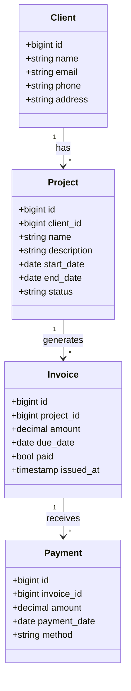

# UML Diagram for Aesthetix Studio Agency Platform

```mermaid
classDiagram
    class Client {
        +bigint id
        +string name
        +string email
        +string phone
        +string address
    }
    class Project {
        +bigint id
        +bigint client_id
        +string name
        +string description
        +date start_date
        +date end_date
        +string status
    }
    class Invoice {
        +bigint id
        +bigint project_id
        +decimal amount
        +date due_date
        +bool paid
        +timestamp issued_at
    }
    class Payment {
        +bigint id
        +bigint invoice_id
        +decimal amount
        +date payment_date
        +string method
    }
    Client "1" --> "*" Project : has
    Project "1" --> "*" Invoice : generates
    Invoice "1" --> "*" Payment : receives
```
